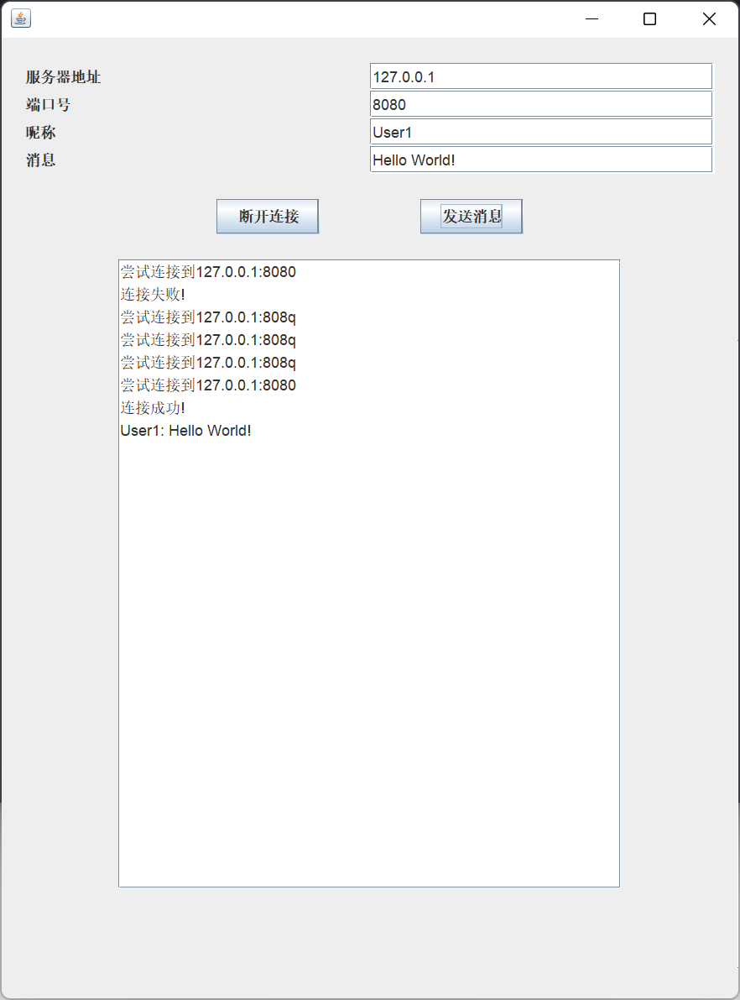

# Scoket Server实验报告

<center>
    姓名：孟俊邑<br>
    学号：3190106104<br>
    专业：计算机科学与技术1901<br>
</center>
## 实验目的

实现一个多客户端的纯文本聊天服务器，能同时接受多个客户端的连接，并将任意一个客户端发送的文本向所有客户端（包括发送方）转发。 

## 功能展示

###  客户端

启动客户端后，界面如下图所示：


用户可以设置服务器的地址和端口，自己的昵称和要发送的消息内容，在默认情况下，这四项都有缺省值。


当服务器未处于开启状态或者服务器地址和端口号非法时，会给出对应的提示。


下图展示了单个用户连接和多个用户连接时聊天室的情景，当只有一个用户时，用户发送消息，会收到回显，当存在多个用户时，则任何一个用户发送的消息都会被广播到当前连接的所有客户端去。




在和服务器的连接建立好之后，`建立连接`按钮会变为`断开连接`，点击即可与服务器断开连接，断连后再次变为`建立连接`。


### 服务端

在我的实现中，服务器端不开放bind IP的功能，仅需要设置端口号，在本机的所有网络接口上侦听，当有用户连接上和断开连接时，服务器端在console上打印出log。

设置端口号的方式有两种，一种通过命令行参数，接受第一个参数作为端口号，二是直接运行，程序会通过``Scanner`读入一个int作为端口号。

下图展示了这两种启动服务器的方式。


## 功能实现

###  客户端

客户端主要以GUI的形式交互式的提供以下功能：设置服务器信息，设置用户昵称，编辑消息内容，连接和发送。

使用Swing框架搭建界面，布局使用了`FlowLayout`，以便于用户在调整窗口大小时仍有较好的显示效果，

从上到下依次放置了各种信息的输入框（InputPanel)，两个按键和聊天室显示窗口。


创建连接时的回调函数展示如下：

```java
e -> {
    if(e.getActionCommand().equals("建立连接")){
        try{
            Integer.parseInt(port.getText());
            chatContext.append(String.format("尝试连接到%s:%s\n", host.getText(), port.getText()));
            chatContext.update(chatContext.getGraphics());
            s = new Socket(host.getText(), Integer.parseInt(port.getText()));
            in = new BufferedReader(
                	new InputStreamReader(
                    	s.getInputStream()));
            out = new PrintStream(
                	s.getOutputStream());

            receiver = new Thread(
                new Runnable(){
                    public void run(){
                        try {
                            while(true){
                                String line = in.readLine();
                                System.out.println(line);
                                if(line == null)
                                    break;
                                else if(!line.equals(""))
                                    chatContext.append(line+'\n');;
                            }
                        }catch(IOException e){
                        }
                    }
                }
            );
            receiver.start();
            chatContext.append("连接成功!\n");
            connect.setText("断开连接");
        }catch (NumberFormatException ex){
            JOptionPane.showMessageDialog(this, "地址格式错误!");
        }catch (IOException ex) {
            JOptionPane.showMessageDialog(this, "连接失败!\n");
            chatContext.append("连接失败!\n");
        }
    }else{
        try{
            s.close();
            chatContext.append("断开连接成功!\n");
            connect.setText("建立连接");
            s = null;
            in = null;
            out = null;
        }catch(Exception ex) {
            JOptionPane.showMessageDialog(this, "内部错误!\n");
            chatContext.append("断开连接失败!\n");
        }
    }
});
```

当socket连接建立成功时，我们开启一个线程进行侦听，一旦接收到了数据，就将数据加入`chatContext`中。

发送消息时的回调函数如下：

```java
e -> {
    if(out != null){
    out.println(nickname.getText()+": "+message.getText());
    out.flush();
    }
});
```

为了在聊天室里面显示出区分，我们发送的消息即为 `昵称：消息内容`的格式。

### 服务端

在服务端的实现中，主要有一个等待客户端连接的线程，一个发送消息的线程和若干个接受客户端消息的线程，一个用于在接收消息的线程和发送消息的线程间通讯的队列。

新客户端的创建：

```java
    ServerSocket socket = new ServerSocket(port);
    System.out.println(String.format("Listening on %s:%s", socket.getInetAddress().toString(), socket.getLocalPort()));
    while (true){
        Socket clientSocket = socket.accept();
        threadPool.execute(new Client(clientSocket, msgSender));
    }
```

```java
    Client(Socket s, msgSender msgSender){
        this.socket = s;
        this.msgSender = msgSender;
        try {
            in = new BufferedReader(
                                new InputStreamReader(
                                    s.getInputStream()));
            out = new PrintStream(
                                s.getOutputStream());
            
            msgSender.addClient(this);
            connected = true;
        } catch (IOException e) {
            e.printStackTrace();
        }
    }
```

当ServerSocket socket接收到新的连接请求后，创建一个client实例，在client的构造函数中，打开输入输出流并将自己加入msgSender的列表中，之后会打开线程等待客户端的输入，并调用`msgSender.broadcast()`在聊天室中发送消息。

为了处理可能存在的多个线程都需要对msgQueue操作的情况，我们使用synchronized锁机制处理，任意时刻只允许一个进程操作msgQueue，而在向msgQueue中添加完消息后，会发出notify信号，发送消息的线程被唤醒，对当前列表中的每个client发送message，实现了聊天室的效果。

```java
class msgSender implements Runnable{
    private final ArrayList<Client> Clients;
    private final Queue<String> msgQueue;
    
    public void broadcast(String msg){
        synchronized(this){
            msgQueue.add(msg);
            this.notify();
        }
    }

    public void addClient(Client s){
        synchronized(this){
            Clients.add(s);
        }
    }

    public void removeClient(){
        synchronized(this){
            Clients.removeIf(Client::getStatus);
        }
    }

    public msgSender(){
        Clients = new ArrayList<Client>();
        msgQueue = new LinkedList<String>();
    }

    public void run(){
        synchronized(this){
            while(true){
                try{
                    while (!msgQueue.isEmpty()){
                        String msg = msgQueue.peek();
                        msgQueue.remove();
                        for (Client s : Clients) {
                            s.sendMsg(msg);
                        }
                    }
                    this.wait();
                }catch(InterruptedException e){
                    e.printStackTrace();
                }
            }
        }
    }
}
```

当某个客户端断开连接时，首先关闭的是对端的socket，对应的in输入流会读到null或者捕获到IOException，这两种情况下，我们将connected设置为false，并调用msgSender.removeClient()函数清扫当前活跃的客户端列表。

```java
        try {
            while(connected){
                line = in.readLine();
                if(line == null)
                    break;
                else if(!line.equals(""))
                    msgSender.broadcast(line);
            }

        }catch(IOException e) {
        
        }finally{
            connected = false;
            System.out.println(String.format("[Remote]%s has disconnected!", socket.getRemoteSocketAddress()));
            try{
                socket.close();
                msgSender.removeClient();
            }catch(IOException e){
                e.printStackTrace();
            }
        }
```


## 实验心得与体会

这次实验的内容比较综合，跨越了GUI，IO和Thread三个章节的内容，通过实现一个socket server，我对相应的知识点都有了更加深刻的理解，尤其是老师上课讲的不能让收消息的线程去发送，会导致阻塞这一点，是我之前自己没有想到过的，通过实现消息队列和发送线程，我理解了这样设计的好处所在，对于今后的学习大有启发。
