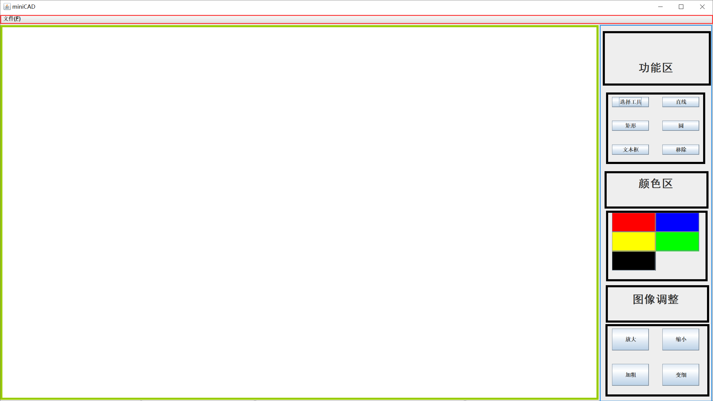

# mini CAD 实验报告

<center>
    姓名：孟俊邑<br>
    学号：3190106104<br>
    专业：计算机科学与技术1901<br>
</center>


## 1 实验要求

做一个简单的绘图工具，以CAD的方式操作，能放置直线、矩形、圆和文字，能选中图形，修改参数，如颜色等，能拖动图形和调整大小，可以保存和恢复。

## 2 实验结果

### 2.1 界面设计



软件界面可以分为三个大部分：菜单栏（`MenuBar`），画板（`Canvas`）和工具箱（`ToolKit`）。这三部分使用`BorderLayout`进行排列，分别放置在`JFrame`的`North`,`Center`,`East`方向。

 在`ToolKit`内部，可以分为六个主要部分，包括三个标签（`JLabel`）和三个功能区域，因此采用`GridLayout`布局，绘图功能区共设置六个功能，使用了`GridLayout(3,2)`对六个`JButton`进行排列，颜色区设置了五个颜色，也使用`GridLayout(3,2)`进行排列，图像调整区设置了放大、缩小、加粗、变细四个功能，使用`GridLayout(2,2)`排列。

### 2.2 功能介绍

#### 2.2.1 菜单栏


菜单栏提供文件相关的操作，包括新建，打开，保存和关闭程序，并设置了相应的快捷键。

+ 新建：丢弃目前的所有更改并清空画板。
+ 打开：打开一个`JFileChooser`并选择保存的`.obj`文件。
+ 保存：打开一个`JFileChooser`并选择保存路径，设置保存文件名，自动添加后缀`.obj`。
+ 退出：调用`System.exit(0)`终止程序。

#### 2.2.2 绘图

1. 选择功能区的某一项工具（默认为选择工具）

2. 在选择工具的状态下，可以通过点击操作选中某个图形，此时图形会出现红色虚线边框，以示区别。

   

3. 当某个图形处于选中状态下时，可以通过按下鼠标按键并拖曳来移动图形

4. 当某个图形处于选中状态下时，可以通过点击移除按钮来删除该图形

5. 当某个图形处于选中状态下时，可以通过点击颜色区的按钮将图形设置为对应颜色

6. 当某个图形处于选中状态下时，可以通过点击图像调整区的按钮进行大小和粗细的调整

   

   如上图，对原始图形进行了移动，改变颜色，放大和加粗的操作。

   ***注：若当前没有选中的图形，调用移除功能以及颜色区和图像调整区的功能不进行任何操作***

7. 若选中的工具为`直线`,`矩形`,`圆`,`文本框`中的任意一个，则可以在`Canvas`上拖动以绘制图形

为了便于老师查看效果，在`miniCAD.jar`同级目录下提供了`test.obj`文件，通过菜单栏的打开功能加载`test.obj`后，显示效果应该如下图所示：


## 3 功能实现

本程序的架构设计参考了Model-View-Controller（模型-视图-控制器，下文简称为MVC） 模式的思想。

- **Model（模型）** - 模型代表一个存取数据的对象或 JAVA POJO。它也可以带有逻辑，在数据变化时更新控制器。
- **View（视图）** - 视图代表模型包含的数据的可视化。
- **Controller（控制器）** - 控制器作用于模型和视图上。它控制数据流向模型对象，并在数据变化时更新视图。它使视图与模型分离开。


为了更加切合本应用的设计场景，我将MVC模型的三层设计成了三个类，分别为`Shape`对应`Model`, `UI`对应`View`, `Listener`对应`Controller`。

### 3.1 Shape

#### 3.1.1 抽象父类

我们定义抽象类`Shape`, 约定了一些所有图形都需要具有的属性：宽度，高度，锚点，颜色和粗细。

***注：锚点为图形左上角的点，根据width和height图形向右下方向延拓***

定义了一系列基本方法：

+ 移动图形
+ 设置颜色
+ 设置绘图属性
+ 在`Graphics`类的某个实例上绘制自身
+ 判断某点是否属于图形内
+ 放大
+ 缩小
+ 加粗
+ 变细

```java
abstract class Shape implements Serializable{
    int width;
    int height;
    Point anchor;
    Color color;
    float thickness;
    void move(int dx, int dy){
        anchor.x += dx;
        anchor.y += dy;
    }
    void set(Graphics2D g){
        g.setStroke(new BasicStroke(thickness));
        g.setColor(color);
    }
    void set_color(Color c){
        color = c;
    }
    abstract void draw(Graphics2D g);
    abstract boolean InRegion(Point p);
    void zoom_in(){
        this.width *= 1.1;
        this.height *= 1.1;
    }   
    void zoom_out(){
        this.width /= 1.1;
        this.height /= 1.1;
    }
    void thicker(){
        this.thickness *= 1.1;
    }
    void thinner(){
        this.thickness /= 1.1;
    }
}
```

#### 3.1.2 Line

直线类的设计在Shape的基础上需要加上`start`和`end`两个点，这是因为仅仅依赖锚点定位是不够的（我们的直线可能是从左下到右上方向延伸的）。

值得一提的是，在检测点击点是否在直线区域类时，我们使用的方法为检测点击到到该直线的距离。

利用公式
$$
直线经过两点(x_1, y_1), (x_2, y_2),则平面内任意一点(x_0,y_0)到该支线的距离为\\
d = \frac{(x_2-x_1)(y_0-y_1) - (y_2-y_1)(x_0-x_1)}{\sqrt{(x_2-x_1)^2 + (y_2-y_1)^2}}
$$


```java
class Line extends Shape{
    Point start;
    Point end;
    // ( (x2-x1)(y0-y1) - (y2-y1)(x0-x1) ) / sqrt((x2-x1)^2 + (y2-y1)^2))
    Line(Point anchor, int width, int height, Point start, Point end, Color c){
        super(anchor, width, height, c);
        this.start = start;
        this.end = end;
    }

    @Override
    void move(int dx, int dy) {
        super.move(dx, dy);
        start.x += dx;
        start.y += dy;
        end.x += dx;
        end.y += dy;
    }

    @Override
    boolean InRegion(Point p){
        double d = Math.abs(1.0*((end.x - start.x)*(p.y - start.y) - (end.y - start.y)*(p.x -start.x))/Math.sqrt(width*width+height*height));
        return  d < 20 &
                p.x >= anchor.x &
                p.x <= anchor.x + width &
                p.y >= anchor.y &
                p.y <= anchor.y + height;
    }

    @Override
    void draw(Graphics2D g) {
        set(g);
        g.drawLine(start.x, start.y, end.x, end.y);
    }

    @Override
    void zoom_in(){
        long dx = Math.round(0.1*(this.end.x-this.start.x));
        long dy = Math.round(0.1*(this.end.y-this.start.y));
        this.end.x += dx;
        this.end.y += dy;
        this.width += dx;
        this.height += dy;
    }

    @Override
    void zoom_out(){
        long dx = Math.round(0.1*(this.end.x-this.start.x));
        long dy = Math.round(0.1*(this.end.y-this.start.y));
        this.end.x -= dx;
        this.end.y -= dy;
        this.width -= dx;
        this.height -= dy;
    }
```

#### 3.1.3 Rectangle

矩形类不需要其他的成员变量去描述，仅需要重写`inRegion`和`draw`方法即可。

```java
class Rectangle extends Shape{
    Rectangle(){
        super();
    }
    Rectangle(Point anchor, int width, int height, Color c){
        super(anchor, width, height, c);
    }

    @Override
    boolean InRegion(Point p){
        return  p.x >= anchor.x &
                p.x <= anchor.x + width &
                p.y >= anchor.y &
                p.y <= anchor.y + height;
    }

    @Override
    void draw(Graphics2D g) {
        set(g);
        g.drawRect(anchor.x, anchor.y, width, height);
    }
}
```

#### 3.1.4 sOval

椭圆类同样不需要其他的成员变量去描述，仅需要重写`inRegion`和`draw`方法即可。

值得一提的是，椭圆的长半轴和短半轴实际由`width`和`height`分别除以2得到。

因此椭圆的圆心位置为`（anchor.x + width/2, anchor.y + height/2）`。

这对于检测点击点是否在椭圆类有重要意义。

```java
class Oval extends Shape{
    Oval(){
        super();
    }
    Oval(Point anchor, int width, int height, Color c){
        super(anchor, width, height, c);
    }

    @Override
    boolean InRegion(Point p){
        double dx = p.x - (anchor.x + width/2);
        double dy = p.y - (anchor.y + height/2);
        return dx*dx/(width*width/4) + dy*dy/(height*height/4) <= 1.0;
    }
    
    @Override
    void draw(Graphics2D g) {
        set(g);
        g.drawOval(anchor.x, anchor.y, width, height);;
    }
}
```

#### 3.1.5 InputBox

文本框类在举行的基础上增加了`s`和`size`成员变量，代表文本内容和字号大小，并根据当前字体，通过`FontMetrics`的`stringWidth`和`getHeight`方法设置文本框的实际占用大小。

```java
class InputBox extends Rectangle{

    String s;
    int size = 20;
    Font font = new Font("黑体", Font.PLAIN, size);
    
    InputBox(Point pos, Color c, String input, Graphics2D g){
        if(c != null)
            color = c;        
        anchor.x = pos.x;
        anchor.y = pos.y;
        s = input;
    }

    @Override
    void draw(Graphics2D g) {
        set(g);
        Font font = new Font("黑体", Font.PLAIN, size);
        FontMetrics fm = g.getFontMetrics(font);
        width = fm.stringWidth(s);
        height = fm.getHeight();
        g.setFont(font);
        g.drawString(s, anchor.x, anchor.y + fm.getHeight());
    }

    @Override
    void zoom_in(){
        this.size += 2;
    }   
    
    @Override
    void zoom_out(){
        this.size -= 2;
    }
}
```

### 3.2 UI

#### 3.2.1 主窗体设计

见`实验结果.界面设计`部分

#### 3.2.2 PaintCanvas类

##### 3.2.2.1 保存与打开

`PaintCanvas`类使用`ArrayList`来存储图形信息

由于`ArrayList`类已经完成了`java.io.Serializable`接口，我们只需要将自定义的`Shape`类完成`java.io.Serializable`接口即可

```java
public void open(File file) throws FileNotFoundException, IOException, ClassNotFoundException{
    flush();
    ObjectInputStream in = new ObjectInputStream(new FileInputStream(file.getAbsolutePath()));
    list = (ArrayList<Shape>) in.readObject();
    in.close();
    clear_buf();
    draw_shapes();
    repaint();
}

public void save(File file) throws FileNotFoundException, IOException{
    ObjectOutputStream out = new ObjectOutputStream(new FileOutputStream(file.getAbsolutePath()));
    out.writeObject(list);
    out.flush();
    out.close();
}
```

##### 3.2.2.2 绘制

为了避免绘图时闪烁，我使用了双缓冲绘图的技术。

```java
private void clear_buf(){
    if(iBuffer == null){
        iBuffer = createImage(this.getSize().width, this.getSize().height);
        gBuffer = (Graphics2D) iBuffer.getGraphics();
    }
    gBuffer.setColor(getBackground());
    gBuffer.fillRect(0, 0 , this.getSize().width, this.getSize().height);
}

private void draw_shapes(){
    for (Shape entity : list) {
        entity.draw(gBuffer);
    }
    if(selected != null){
        final BasicStroke s = new BasicStroke(3.0f, BasicStroke.CAP_BUTT,
                                              BasicStroke.JOIN_MITER, 10.0f, new float[] { 5, 5 }, 0.0f);
        gBuffer.setStroke(s);            
        gBuffer.setColor(Color.RED);
        gBuffer.drawRect(selected.anchor.x, selected.anchor.y, selected.width, selected.height);
    }
}
@Override
public void update(Graphics g) {
    g.drawImage(iBuffer, 0, 0, this);
}
```

每次需要刷新图形时，先将图形绘制在`gBuffer`上，最后在外部调用`canvas`组件的`repaint()`方法，由`repaint()`方法调用`update`函数将缓冲区的图像显示到`PaintCanvas`组件上。

### 3.3 Listener

在`Listener`内部持有一个`PaintCanvas` 的实例，通过调用`PaintCanvas`提供的接口完成各项功能。

## 4 实验心得

在上本课程之前，基本没有Java GUI程序的设计经验，对于如何本程序的概念一直很模糊。后来查阅了一些软件工程的内容，了解了MVC模型，有了些许的思路。但在实践的过程中，我实现的并不是很好，仍有大量的耦合存在，如`PaintCanvas`组件和`Listener`组件都是由`UI`类的`main`函数程序创建的，而`Listener`为了使用`PaintCanvas`的接口，需要持有一个`PaintCanvas` 的实例，这显然是违反设计理念的。

后面我想到了可以使用`static`的成员变量，在`PaintCanvas`类存放一个自己的实例，同时设计接口，通过接口再调用自己唯一实例的方法，遗憾的是时间不是很充裕了，草草收场留下了遗憾，希望在软件工程课上可以更加深入地了解设计模式相关的内容。